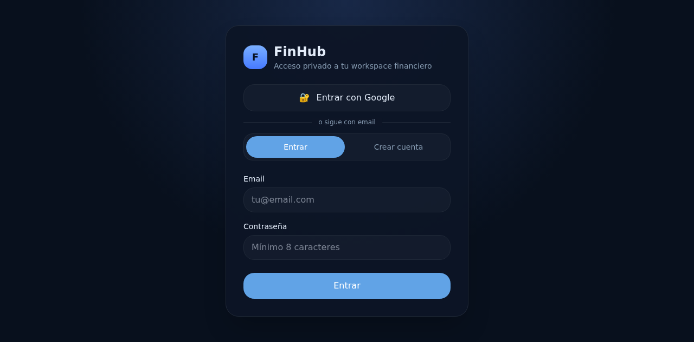

# FinHub

> Self-hosted personal finance hub for Europe. Consolidate bank accounts, card spend (with Curve deduplication), budgets, and investments — all under your control.

[](https://finhub.vatotech.es)
[](LICENSE)
[](https://fastapi.tiangolo.com)
[](https://nextjs.org)
[](https://postgresql.org)

<p align="center">
  
</p>

---

## Features

- **Open Banking** — connect European banks via GoCardless (Nordigen) and sync transactions automatically
- **Curve deduplication** — bank entries with `CRV-*` descriptors are detected as Curve settlement transactions and don't inflate your spending
- **Manual expenses** — add cash payments or planned expenses alongside bank data
- **Budgets** — per-category budget tracking with rollup to monthly views
- **Recurring detection** — automatically identifies and shows recurring/subscription payments
- **Multi-month calendar** — see upcoming scheduled and recurring transactions
- **Dashboard** — consolidated balance, income vs expenses, monthly evolution charts
- **Multi-user** — local auth + Google OAuth, data scoped per user
- **Docker Compose deploy** — self-host on any VPS with PostgreSQL

---

## Quickstart (local dev)

```bash
# Clone & enter
git clone git@github.com:vatodevops/FinHub.git
cd FinHub

# Start everything — backend + frontend + SQLite local DB
./run-local.sh

# Reset local DB if needed
./reset-local-db.sh

# Stop
./stop-local.sh
```

Open **http://localhost:3001** → register a user → done.

### Backend only

```bash
cd backend
pip install -e .[test]
uvicorn app.main:app --reload --port 8081
```

### Frontend only

```bash
cd frontend
npm install
npm run dev  # port 3001
```

### Tests

```bash
cd backend
pytest                          # all
pytest tests/test_file.py       # single file
pytest -x -v                    # stop on first failure, verbose
```

---

## Architecture

```
┌─────────────┐       ┌──────────────┐       ┌────────────────┐
│  Frontend   │──────▶│   Backend    │──────▶│  PostgreSQL /  │
│  Next.js 15 │  API  │  FastAPI     │  ORM  │  SQLite (dev)  │
│  React 19   │◀──────│  SQLAlchemy  │◀──────│                │
└─────────────┘       └──────┬───────┘       └────────────────┘
                             │
                     ┌───────▼────────┐
                     │  GoCardless /  │
                     │  Nordigen API  │
                     │  (Open Banking)│
                     └────────────────┘
```

| Layer | Technology |
|---|---|
| Backend | FastAPI, SQLAlchemy, Alembic |
| Frontend | Next.js 15, React 19, Tailwind 4, Recharts |
| Database | PostgreSQL (prod), SQLite (local dev) |
| Auth | Session cookies + Google OAuth |
| Bank sync | GoCardless Account Information API |
| Deployment | Docker Compose, Traefik/Pangolin |

---

## Project structure

```
FinHub/
├── backend/
│   ├── app/
│   │   ├── api/routers/     # FastAPI endpoints (accounts, transactions, budgets…)
│   │   ├── core/            # config, logging, exceptions
│   │   ├── models/          # SQLAlchemy ORM
│   │   ├── schemas/         # Pydantic request/response
│   │   ├── services/        # business logic (reconciliation, dedup, sync…)
│   │   └── db/              # engine, session, seed
│   ├── alembic/             # migrations
│   └── tests/
├── frontend/
│   ├── app/                 # Next.js App Router pages
│   └── lib/                 # API client, auth context
├── deploy/
│   ├── docker-compose*.yml  # prod / staging / local
│   ├── scripts/             # backup, restore, promote
│   └── README_PROD.md       # production setup guide
└── docs/                    # architecture, feature specs
```

---

## Production deploy

See [deploy/README_PROD.md](deploy/README_PROD.md) for:

- VPS setup with Docker Compose + PostgreSQL
- Traefik/Pangolin TLS termination
- Staging → promote workflow via GitHub Actions
- Backup & restore procedures

**Live instance**: [finhub.vatotech.es](https://finhub.vatotech.es)

---

## Roadmap

- [x] Open Banking sync (GoCardless)
- [x] Curve deduplication
- [x] Dashboard & monthly evolution
- [x] Manual & recurring expenses
- [x] Budgets
- [x] Multi-user auth
- [ ] Investments tracking (phase 2)
- [ ] Net worth history
- [ ] Custom alerts & rules
- [ ] Plutus / other card provider support

---

## License

[MIT](LICENSE)

## Contributing

PRs welcome! See [CONTRIBUTING.md](CONTRIBUTING.md).